# Telecom Churn Analysis: How To Keep Your Customers "On the Line"
---
Authors: Jared Mitchell, Andrew Marinelli, Wes Newcomb

## Overview
---
In this notebook, we analyze and build classification models with the data from Syria, a telecom company, in an effort to understand the relationships and patterns between several customer variables and customer churn. After cleaning and encoding the data, we take an iterative and comparative approach to model production, eventually converging in a robust classification model that can determine with sufficient power the likelihood that a given customer will churn. 

## Business Understanding
---
Churn has long been king for companies wishing to determine the success of their product. Intuitively, customers wouldn't drop your service if they liked it, right? According to churn expert Patrick Campbell, "Your churn rate is a direct reflection of the value of the product and features that you're offering to customers." Further, when combined with other features of your service, such as cost, we can determine the price at which the offered service becomes most profitable. The idea is that we're willing to lose some customers to an increased cost of service as long as the double bottom line profit grows as a result. Thus, the question is born: Is there a way that we can predict churn on a client-by-client basis, so that we can shift from a <b>reactive</b> to a <b>proactive</b> approach to business decisions with respect to items such as product feature implementations, customer service operations, retention campaigns, and pricing optimization? The short answer is yes; armed with a predictive model, SyriaTel can not only make its service better, but it can also increase its profits. 

## Data Exploration
---
The SyriaTel dataset consists of 21 columns and 3333 rows. Each row represents information about a unique account holder. The dataset was complete and consistent for all rows upon our reception of it. It is not clear the time period that this dataset represents.


```python
import numpy as np
import pandas as pd
import matplotlib.pyplot as plt
import seaborn as sns
import plotly.express as px  # Be sure to import express
%matplotlib inline
```


```python
df = pd.read_csv('data/telecom_customer_churn.csv')
df.head()
```


<div>
<style scoped>
    .dataframe tbody tr th:only-of-type {
        vertical-align: middle;
    }

    .dataframe tbody tr th {
        vertical-align: top;
    }

    .dataframe thead th {
        text-align: right;
    }
</style>
<table border="1" class="dataframe">
  <thead>
    <tr style="text-align: right;">
      <th></th>
      <th>state</th>
      <th>account length</th>
      <th>area code</th>
      <th>phone number</th>
      <th>international plan</th>
      <th>voice mail plan</th>
      <th>number vmail messages</th>
      <th>total day minutes</th>
      <th>total day calls</th>
      <th>total day charge</th>
      <th>...</th>
      <th>total eve calls</th>
      <th>total eve charge</th>
      <th>total night minutes</th>
      <th>total night calls</th>
      <th>total night charge</th>
      <th>total intl minutes</th>
      <th>total intl calls</th>
      <th>total intl charge</th>
      <th>customer service calls</th>
      <th>churn</th>
    </tr>
  </thead>
  <tbody>
    <tr>
      <th>0</th>
      <td>KS</td>
      <td>128</td>
      <td>415</td>
      <td>382-4657</td>
      <td>no</td>
      <td>yes</td>
      <td>25</td>
      <td>265.1</td>
      <td>110</td>
      <td>45.07</td>
      <td>...</td>
      <td>99</td>
      <td>16.78</td>
      <td>244.7</td>
      <td>91</td>
      <td>11.01</td>
      <td>10.0</td>
      <td>3</td>
      <td>2.70</td>
      <td>1</td>
      <td>False</td>
    </tr>
    <tr>
      <th>1</th>
      <td>OH</td>
      <td>107</td>
      <td>415</td>
      <td>371-7191</td>
      <td>no</td>
      <td>yes</td>
      <td>26</td>
      <td>161.6</td>
      <td>123</td>
      <td>27.47</td>
      <td>...</td>
      <td>103</td>
      <td>16.62</td>
      <td>254.4</td>
      <td>103</td>
      <td>11.45</td>
      <td>13.7</td>
      <td>3</td>
      <td>3.70</td>
      <td>1</td>
      <td>False</td>
    </tr>
    <tr>
      <th>2</th>
      <td>NJ</td>
      <td>137</td>
      <td>415</td>
      <td>358-1921</td>
      <td>no</td>
      <td>no</td>
      <td>0</td>
      <td>243.4</td>
      <td>114</td>
      <td>41.38</td>
      <td>...</td>
      <td>110</td>
      <td>10.30</td>
      <td>162.6</td>
      <td>104</td>
      <td>7.32</td>
      <td>12.2</td>
      <td>5</td>
      <td>3.29</td>
      <td>0</td>
      <td>False</td>
    </tr>
    <tr>
      <th>3</th>
      <td>OH</td>
      <td>84</td>
      <td>408</td>
      <td>375-9999</td>
      <td>yes</td>
      <td>no</td>
      <td>0</td>
      <td>299.4</td>
      <td>71</td>
      <td>50.90</td>
      <td>...</td>
      <td>88</td>
      <td>5.26</td>
      <td>196.9</td>
      <td>89</td>
      <td>8.86</td>
      <td>6.6</td>
      <td>7</td>
      <td>1.78</td>
      <td>2</td>
      <td>False</td>
    </tr>
    <tr>
      <th>4</th>
      <td>OK</td>
      <td>75</td>
      <td>415</td>
      <td>330-6626</td>
      <td>yes</td>
      <td>no</td>
      <td>0</td>
      <td>166.7</td>
      <td>113</td>
      <td>28.34</td>
      <td>...</td>
      <td>122</td>
      <td>12.61</td>
      <td>186.9</td>
      <td>121</td>
      <td>8.41</td>
      <td>10.1</td>
      <td>3</td>
      <td>2.73</td>
      <td>3</td>
      <td>False</td>
    </tr>
  </tbody>
</table>
<p>5 rows × 21 columns</p>
</div>


The information provided per client includes how long they've been with SyriaTel in months (account length); which plans they are signed up for (international plan, voice mail plan); usage metrics (total day minutes, total night charge); the number of calls they made to customer support; and of course, churn status. 


```python
df.info()
```

    <class 'pandas.core.frame.DataFrame'>
    RangeIndex: 3333 entries, 0 to 3332
    Data columns (total 21 columns):
     #   Column                  Non-Null Count  Dtype  
    ---  ------                  --------------  -----  
     0   state                   3333 non-null   object 
     1   account length          3333 non-null   int64  
     2   area code               3333 non-null   int64  
     3   phone number            3333 non-null   object 
     4   international plan      3333 non-null   object 
     5   voice mail plan         3333 non-null   object 
     6   number vmail messages   3333 non-null   int64  
     7   total day minutes       3333 non-null   float64
     8   total day calls         3333 non-null   int64  
     9   total day charge        3333 non-null   float64
     10  total eve minutes       3333 non-null   float64
     11  total eve calls         3333 non-null   int64  
     12  total eve charge        3333 non-null   float64
     13  total night minutes     3333 non-null   float64
     14  total night calls       3333 non-null   int64  
     15  total night charge      3333 non-null   float64
     16  total intl minutes      3333 non-null   float64
     17  total intl calls        3333 non-null   int64  
     18  total intl charge       3333 non-null   float64
     19  customer service calls  3333 non-null   int64  
     20  churn                   3333 non-null   bool   
    dtypes: bool(1), float64(8), int64(8), object(4)
    memory usage: 524.2+ KB


```python
df.describe()
```


<div>
<style scoped>
    .dataframe tbody tr th:only-of-type {
        vertical-align: middle;
    }

    .dataframe tbody tr th {
        vertical-align: top;
    }

    .dataframe thead th {
        text-align: right;
    }
</style>
<table border="1" class="dataframe">
  <thead>
    <tr style="text-align: right;">
      <th></th>
      <th>account length</th>
      <th>area code</th>
      <th>number vmail messages</th>
      <th>total day minutes</th>
      <th>total day calls</th>
      <th>total day charge</th>
      <th>total eve minutes</th>
      <th>total eve calls</th>
      <th>total eve charge</th>
      <th>total night minutes</th>
      <th>total night calls</th>
      <th>total night charge</th>
      <th>total intl minutes</th>
      <th>total intl calls</th>
      <th>total intl charge</th>
      <th>customer service calls</th>
    </tr>
  </thead>
  <tbody>
    <tr>
      <th>count</th>
      <td>3333.000000</td>
      <td>3333.000000</td>
      <td>3333.000000</td>
      <td>3333.000000</td>
      <td>3333.000000</td>
      <td>3333.000000</td>
      <td>3333.000000</td>
      <td>3333.000000</td>
      <td>3333.000000</td>
      <td>3333.000000</td>
      <td>3333.000000</td>
      <td>3333.000000</td>
      <td>3333.000000</td>
      <td>3333.000000</td>
      <td>3333.000000</td>
      <td>3333.000000</td>
    </tr>
    <tr>
      <th>mean</th>
      <td>101.064806</td>
      <td>437.182418</td>
      <td>8.099010</td>
      <td>179.775098</td>
      <td>100.435644</td>
      <td>30.562307</td>
      <td>200.980348</td>
      <td>100.114311</td>
      <td>17.083540</td>
      <td>200.872037</td>
      <td>100.107711</td>
      <td>9.039325</td>
      <td>10.237294</td>
      <td>4.479448</td>
      <td>2.764581</td>
      <td>1.562856</td>
    </tr>
    <tr>
      <th>std</th>
      <td>39.822106</td>
      <td>42.371290</td>
      <td>13.688365</td>
      <td>54.467389</td>
      <td>20.069084</td>
      <td>9.259435</td>
      <td>50.713844</td>
      <td>19.922625</td>
      <td>4.310668</td>
      <td>50.573847</td>
      <td>19.568609</td>
      <td>2.275873</td>
      <td>2.791840</td>
      <td>2.461214</td>
      <td>0.753773</td>
      <td>1.315491</td>
    </tr>
    <tr>
      <th>min</th>
      <td>1.000000</td>
      <td>408.000000</td>
      <td>0.000000</td>
      <td>0.000000</td>
      <td>0.000000</td>
      <td>0.000000</td>
      <td>0.000000</td>
      <td>0.000000</td>
      <td>0.000000</td>
      <td>23.200000</td>
      <td>33.000000</td>
      <td>1.040000</td>
      <td>0.000000</td>
      <td>0.000000</td>
      <td>0.000000</td>
      <td>0.000000</td>
    </tr>
    <tr>
      <th>25%</th>
      <td>74.000000</td>
      <td>408.000000</td>
      <td>0.000000</td>
      <td>143.700000</td>
      <td>87.000000</td>
      <td>24.430000</td>
      <td>166.600000</td>
      <td>87.000000</td>
      <td>14.160000</td>
      <td>167.000000</td>
      <td>87.000000</td>
      <td>7.520000</td>
      <td>8.500000</td>
      <td>3.000000</td>
      <td>2.300000</td>
      <td>1.000000</td>
    </tr>
    <tr>
      <th>50%</th>
      <td>101.000000</td>
      <td>415.000000</td>
      <td>0.000000</td>
      <td>179.400000</td>
      <td>101.000000</td>
      <td>30.500000</td>
      <td>201.400000</td>
      <td>100.000000</td>
      <td>17.120000</td>
      <td>201.200000</td>
      <td>100.000000</td>
      <td>9.050000</td>
      <td>10.300000</td>
      <td>4.000000</td>
      <td>2.780000</td>
      <td>1.000000</td>
    </tr>
    <tr>
      <th>75%</th>
      <td>127.000000</td>
      <td>510.000000</td>
      <td>20.000000</td>
      <td>216.400000</td>
      <td>114.000000</td>
      <td>36.790000</td>
      <td>235.300000</td>
      <td>114.000000</td>
      <td>20.000000</td>
      <td>235.300000</td>
      <td>113.000000</td>
      <td>10.590000</td>
      <td>12.100000</td>
      <td>6.000000</td>
      <td>3.270000</td>
      <td>2.000000</td>
    </tr>
    <tr>
      <th>max</th>
      <td>243.000000</td>
      <td>510.000000</td>
      <td>51.000000</td>
      <td>350.800000</td>
      <td>165.000000</td>
      <td>59.640000</td>
      <td>363.700000</td>
      <td>170.000000</td>
      <td>30.910000</td>
      <td>395.000000</td>
      <td>175.000000</td>
      <td>17.770000</td>
      <td>20.000000</td>
      <td>20.000000</td>
      <td>5.400000</td>
      <td>9.000000</td>
    </tr>
  </tbody>
</table>
</div>


```python
df['churn'].value_counts()
```


    False    2850
    True      483
    Name: churn, dtype: int64


We are apparently dealing with an unbalanced dataset, which means that we will have to be careful in applying proper weights to our outcome groups. However, the imbalance is not so extreme as to beckon measures that hedge against the potential skewing of results. 

## Data Preparation
---

Some of the columns were immediately identifiable as being not relevant to predicting churn - such as phone number and area code. We dropped these columns from the data set outright. One might immediately think that area code is connected to customer region. However, some people (perhaps a majority) keep their numbers when they move, so someone with a San Francisco phone number could very well be living in South Dakota. We can safely conclude that area code does not contain robust customer information, and because phone numbers are semi-randomly generated, the same can be said for its column. 


```python
# drop columns of little importance to determining churn, as determined by ...
# the fact that they are arbitrarily assigned by the telecom company
df = df.drop(['area code', 'phone number'], axis=1)
```

Some of the columns needed to be reformatted from yes/no to binary, 1/0 style. 


```python
df['churn'] = df['churn'].astype(int)
df['international plan'] = df['international plan'].map(lambda x: 1 if x=='yes' else 0)
df['voice mail plan'] = df['voice mail plan'].map(lambda x: 1 if x=='yes' else 0)
```

Further, the successes of some telecom companies are regional specific - perhaps they offer great coverage in some regions, but terrible coverage in other regions. However, this is not the case for SyriaTel, as they do not have characteristic regional customer counts or churn rates. We can see this from the following visual representations. 


```python
states_df = pd.DataFrame(df.state.value_counts()).reset_index()
states_df = states_df.rename(columns={'index':'state', 'state':'value_count'})
states_df = states_df.sort_values('state')
states_df = states_df.merge(df.groupby(['state'])['churn'].mean(), on='state')
states_df['churn'] = states_df['churn'] * 100
```

```python
gb = df.groupby(['state'])['churn'].mean() * 100
gb.sort_values().plot(kind='bar', figsize=(12,12));
plt.title('Churn Rate By State', fontsize=14);
plt.ylabel('Churn Rate (%)');
plt.xlabel('State')
plt.show()
```


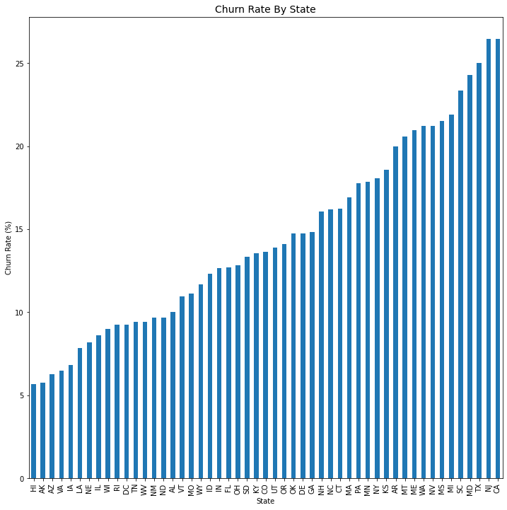


While some areas are do have significantly higher churn rates than others, we cannot take this as chracteristic of the state customer populations because the populations by state are small - if we only have data on 30 customers from California, we cannot be confident that the statistcs on those 30 customers represent all the customers in California. Finally, we can say with relative certainty that the regional representations in the dataset do not chracterize the churn rates - states with a larger representation are not more likely to represent high or lower churn rates, generally speaking, than states with smaller representation. 


```python
states_df.corr()
```


<div>
<style scoped>
    .dataframe tbody tr th:only-of-type {
        vertical-align: middle;
    }

    .dataframe tbody tr th {
        vertical-align: top;
    }

    .dataframe thead th {
        text-align: right;
    }
</style>
<table border="1" class="dataframe">
  <thead>
    <tr style="text-align: right;">
      <th></th>
      <th>value_count</th>
      <th>churn</th>
    </tr>
  </thead>
  <tbody>
    <tr>
      <th>value_count</th>
      <td>1.000000</td>
      <td>-0.001216</td>
    </tr>
    <tr>
      <th>churn</th>
      <td>-0.001216</td>
      <td>1.000000</td>
    </tr>
  </tbody>
</table>
</div>


As a result, we can drop the state column from the dataset.


```python
df = df.drop(['state'], axis=1)
```

We do have some columns that are nearly perfectly collinear as well:


```python
sns.heatmap(df.corr().abs());
plt.title('Correlations Between Telecom Variables', fontsize=14)
plt.show()
```


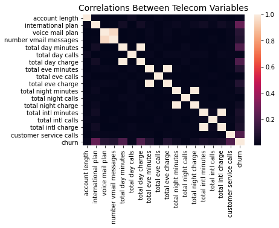


Since number of user minutes per time period is a more direct metric than charge per corresponding time period; and because number of voicemail messages and total international charge are directly consistent with whether a customer has a plan for each, respectively, we can safely drop those columns from the dataset. 


```python
df = df.drop(['number vmail messages','total day charge','total eve charge', 
             'total night charge', 'total intl charge'], axis=1)
```

Train-test split, <i>et voilà</i> ! The dataset is clean and ready for production. 


```python
from sklearn.model_selection import train_test_split
from sklearn.preprocessing import StandardScaler
from sklearn.preprocessing import MinMaxScaler

X_cols = df.drop(['churn'], axis=1).columns
y_cols = ['churn']

X = df.drop(['churn'], axis=1)
y = df['churn']

X_train, X_test, y_train, y_test = train_test_split(X, y, stratify=y, random_state=42)
```

## Modeling
---
We took an iterative approach to modeling the data: starting with a baseline, then progressing through the simplest models; and finally, exploring more advanced models.

We determined that a customized F-style score is the most appropriate metric for measuring the success of our model because (1) we are dealing with imbalanced data, thus a skewed high baseline accuracy; and (2) we are interested in a healthy medium between identifying customers who are going to churn and misidentifying customers who are not going to churn. You could understand this simply as: each customer we save from churn yields a large increase in revenue; where every customer we misidentify as churn yields a small decrease revenue. Thus we decided to optimize our models against the F4-score: a model scoring system that quadruple weights recall with respect to precision. We do this because we understand that the cost of losing a customer is far more expensive that the cost of accidentally being overly generous with a customer who we were not going to lose in the first place. 


```python
#import all necessary packages for modeling
from sklearn.linear_model import LogisticRegression
from sklearn.model_selection import RepeatedStratifiedKFold
from sklearn.feature_selection import RFE
from sklearn.pipeline import Pipeline
from sklearn.dummy import DummyClassifier
from sklearn.model_selection import cross_val_score
from sklearn.preprocessing import Normalizer
from sklearn.neighbors import KNeighborsClassifier
from sklearn.model_selection import GridSearchCV
from sklearn.ensemble import RandomForestClassifier
from sklearn.metrics import classification_report, precision_score, \
                            accuracy_score, recall_score, f1_score
from sklearn.metrics import confusion_matrix
from sklearn.metrics import plot_confusion_matrix
from sklearn.naive_bayes import GaussianNB
from sklearn.tree import DecisionTreeClassifier
from sklearn.metrics import fbeta_score, make_scorer
```


```python
f4_score = make_scorer(fbeta_score, beta=4)
```

### Baseline Model

Logically, we should start out with the current state of the company. SyriaTel does not have any way of predicting customer churn at the moment; in other words, SyriaTel treats every customer as though they were not going to churn. Our baseline model reflects this strategem. 


```python
dummy = DummyClassifier(strategy='most_frequent', random_state=42)
dummy.fit(X_train, y_train)
cv = cross_val_score(dummy, X_train, y_train, scoring='f1')
cv
```


    array([0., 0., 0., 0., 0.])


```python
y_pred_dummy = dummy.predict(X_test)

print(classification_report(y_test, y_pred_dummy, zero_division=0))
plot_confusion_matrix(estimator=dummy, X=X_test, y_true=y_test);
```

                  precision    recall  f1-score   support
    
               0       0.85      1.00      0.92       713
               1       0.00      0.00      0.00       121
    
        accuracy                           0.85       834
       macro avg       0.43      0.50      0.46       834
    weighted avg       0.73      0.85      0.79       834
    


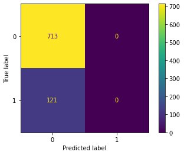


Clearly, we are starting from zero here: Our F4-score is 0, even though we do have 85% accuracy. 

### Logistic Regression

We decided that Logistic Regression would make a good starting point as it is relatively simple to understand and easy to implement. Our approach iteratively added features with respect to feature importance as judged by its relative ability to determine our target variable. Additionally, we tuned our Logistic Regressor hyperparameters over sufficient parameter space to say that this is the best logistic regression model obtainable, given certain time and complexity constraints. We also experimented with different data preprocessing techniques. 


```python
lr_pipe = Pipeline(steps=[
                    ('scaler', MinMaxScaler()),
                    ('rfe', RFE(estimator=LogisticRegression(random_state=42))),
                    ('lr', LogisticRegression(random_state=42))
                        ])

lr_grid = {'scaler':[MinMaxScaler(), StandardScaler()],
           'rfe__n_features_to_select':list(range(1,12)),
           'lr__tol':[.01, .0001, .000001],
           'lr__C':[100, 10, 1, .1, .01, .001],
           'lr__class_weight':[None, 'balanced']}
```


```python
lr_gs = GridSearchCV(estimator=lr_pipe, 
                     param_grid=lr_grid, 
                     cv=RepeatedStratifiedKFold(n_splits=5, 
                                                n_repeats=3, 
                                                random_state=42),
                     scoring=f4_score)

lr_gs.fit(X_train, np.ravel(y_train))

lr_best = lr_gs.best_estimator_
```


```python
y_train_pred_lr = lr_best.predict(X_train)
y_test_pred_lr = lr_best.predict(X_test)

print('Train Statistics')
print(classification_report(y_train, y_train_pred_lr))
print()
print('Test Statistics')
print(classification_report(y_test, y_test_pred_lr))
plot_confusion_matrix(estimator=lr_best, X=X_train, y_true=y_train);
plt.title('Train');
plot_confusion_matrix(estimator=lr_best, X=X_test, y_true=y_test);
plt.title('Test');
```

    Train Statistics
                  precision    recall  f1-score   support
    
               0       0.95      0.80      0.87      2137
               1       0.39      0.76      0.52       362
    
        accuracy                           0.79      2499
       macro avg       0.67      0.78      0.69      2499
    weighted avg       0.87      0.79      0.82      2499
    
    
    Test Statistics
                  precision    recall  f1-score   support
    
               0       0.94      0.78      0.85       713
               1       0.35      0.70      0.47       121
    
        accuracy                           0.77       834
       macro avg       0.65      0.74      0.66       834
    weighted avg       0.85      0.77      0.80       834
    


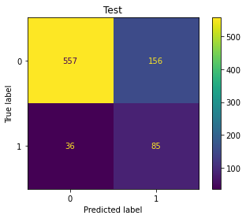


This model shows a significant improvement from baseline, with an F1-score of 0.47 while only sacrificing 8 accuracy points. Additionally, it does not appear as though we are overfitting. 

### k-Nearest Neighbors

We also took an iterative approach to creating our kNN model, incorporating features into our model with resepect to their correlation with the target variable, churn; however, we do not contend that the feature combination we found to produce the best model is necessarily the best combination. Feature selection in kNNs can be particularly challenging, and the most modern methods are not comprehensive. 


```python
corrs = df.corr().abs()['churn'].sort_values(ascending=False).drop('churn')
ordered_corrs = list(corrs.index)
```


```python
knn_pipe = Pipeline([('scaler', StandardScaler()),
                     ('normalizer', Normalizer()),
                     ('knn', KNeighborsClassifier())])

knn_grid = {
    'scaler':[None, StandardScaler(), MinMaxScaler()],
    'normalizer':[None, Normalizer()],
    'knn__n_neighbors':[1,3,7,11,17],
    'knn__p':[1,2,3],
    'knn__weights': ['uniform','distance']
}
```


```python
models = []
num_features = []
train_preds = []
test_preds = []

for i in range(1, len(ordered_corrs)):
    
    features = ordered_corrs[:i]
    
    X_train_knn = X_train[features]
    X_test_knn = X_test[features]
    
    cv = RepeatedStratifiedKFold(n_splits=5, n_repeats=3, random_state=42)
    gs_knn = GridSearchCV(estimator=knn_pipe, 
                          param_grid=knn_grid, 
                          cv=cv,
                          scoring=f4_score)
    
    gs_knn.fit(X_train_knn, np.ravel(y_train))
    
    y_pred_train = gs_knn.predict(X_train_knn)
    y_pred_test = gs_knn.predict(X_test_knn)
    
    models.append(gs_knn.best_estimator_)
    num_features.append(str(i))
    train_preds.append(y_pred_train)
    test_preds.append(y_pred_test)
```


```python
accuracy_scores = []
precision_scores = []
recall_scores = []
f1_scores = []

for i in range(len(num_features)):
    
    y_train_pred = train_preds[i]
    y_test_pred = test_preds[i]
    
    accuracy_scores.append(accuracy_score(y_test, y_test_pred))
    precision_scores.append(precision_score(y_test, y_test_pred))
    recall_scores.append(recall_score(y_test, y_test_pred))
    f1_scores.append(f1_score(y_test, y_test_pred))
```

We can see from the graphic below that we achieve our maximum F1-score at 8 features, while maintaining healthy accuracy, recall, and precision levels.  


```python
plt.plot(num_features, precision_scores, label='Precision')
plt.plot(num_features, accuracy_scores, label='Accuracy')
plt.plot(num_features, recall_scores, label='Recall')
plt.plot(num_features, f1_scores, label='F1')
plt.legend()
plt.show()
```


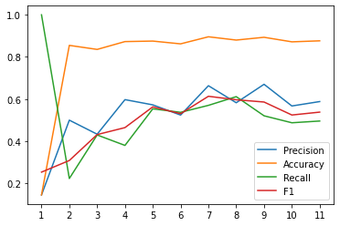


```python
ss = StandardScaler()
normalizer = Normalizer()
knn_best = KNeighborsClassifier(n_neighbors=3, p=1, weights='distance')

X_train_knn = ss.fit_transform(X_train[ordered_corrs[:8]])
X_test_knn = ss.transform(X_test[ordered_corrs[:8]])

X_train_knn = normalizer.transform(X_train_knn)
X_test_knn = normalizer.transform(X_test_knn)

knn_best.fit(X_train_knn, y_train)
```


    KNeighborsClassifier(n_neighbors=3, p=1, weights='distance')


```python
y_train_pred_knn = knn_best.predict(X_train_knn)
y_test_pred_knn = knn_best.predict(X_test_knn)

print(classification_report(y_train, y_train_pred_knn))
print(classification_report(y_test, y_test_pred_knn))
plot_confusion_matrix(knn_best, X=X_train_knn, y_true=y_train);
plt.title('Train');
plot_confusion_matrix(knn_best, X=X_test_knn, y_true=y_test);
plt.title('Test');
```

                  precision    recall  f1-score   support
    
               0       1.00      1.00      1.00      2137
               1       1.00      1.00      1.00       362
    
        accuracy                           1.00      2499
       macro avg       1.00      1.00      1.00      2499
    weighted avg       1.00      1.00      1.00      2499
    
                  precision    recall  f1-score   support
    
               0       0.93      0.95      0.94       713
               1       0.66      0.57      0.61       121
    
        accuracy                           0.89       834
       macro avg       0.79      0.76      0.77       834
    weighted avg       0.89      0.89      0.89       834
    


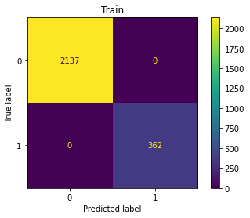


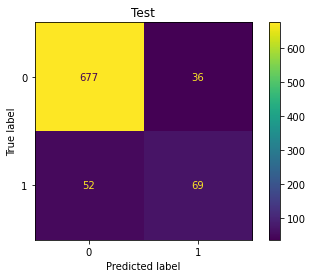


We see a significant improvement in both overall accuracy as well as F1-score with respect to the logistic regession model. Not bad! However, we may be overfitting, which we can see from the dramatic differences between train and test scores across various metrics. To resolve this, we will remove some of the input features to reduce model complexity.

### Naive Bayes

Naive Bayes offers another simple approach to predicting churn. We chose not to incorporate feature selection here because Naive Bayes usually benefits from more features, given that that number is not extraneously large (in the order of hundreds). 


```python
gnb_pipe = Pipeline(steps=[
    ('scaler', StandardScaler()),
    ('gnb', GaussianNB())
    ])

gnb_grid = {'scaler':[None, StandardScaler()],
           'gnb__var_smoothing':[1e-12, 1e-9, 1e-6, 1e-3]}

cv = RepeatedStratifiedKFold(n_splits=5, n_repeats=3, random_state=42)

gs_gnb = GridSearchCV(estimator=gnb_pipe,
                     param_grid=gnb_grid,
                     scoring=f4_score)

gs_gnb.fit(X_train, y_train)

gnb_best = gs_gnb.best_estimator_
```


```python
y_train_pred_gnb = gnb_best.predict(X_train)
y_test_pred_gnb = gnb_best.predict(X_test)

print('Train')
print(classification_report(y_train, y_train_pred_gnb))
print()
print('Test')
print(classification_report(y_test, y_test_pred_gnb))
plot_confusion_matrix(gnb_best, X_train, y_train);
plt.title('Train');
plot_confusion_matrix(gnb_best, X_test, y_test);
plt.title('Test');
```

    Train
                  precision    recall  f1-score   support
    
               0       0.90      0.93      0.92      2137
               1       0.50      0.43      0.46       362
    
        accuracy                           0.85      2499
       macro avg       0.70      0.68      0.69      2499
    weighted avg       0.85      0.85      0.85      2499
    
    
    Test
                  precision    recall  f1-score   support
    
               0       0.90      0.91      0.91       713
               1       0.44      0.41      0.43       121
    
        accuracy                           0.84       834
       macro avg       0.67      0.66      0.67       834
    weighted avg       0.83      0.84      0.84       834
    


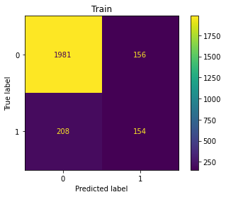


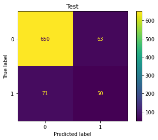


This may not be our best-performing model, but its results are still better than our baseline. Additionally, we do not have evidence of a case of overfitting, as the test evaulation metrics reflect the train evaulation metrics to a high degree. 

### Simple Decision Tree

Our final simple model, the decision tree is powerful because of its bare-bones preprocessing requirements. There is no concept of recursive feature elimination for decision trees, but we still took a grid search approach to determing the best hyperparameters.  


```python
dt_pipe = Pipeline(steps=[('dt', DecisionTreeClassifier(random_state=42))])

dt_grid = {
    'dt__criterion':['gini','entropy'],
    'dt__max_depth':list(range(2,16)),
    'dt__min_samples_split':list(range(2,12)),
    'dt__min_samples_leaf':list(range(5,25,4)),
    'dt__class_weight':[None, 'balanced']
}

cv = RepeatedStratifiedKFold(n_splits=5, n_repeats=3, random_state=42)

gs_dt = GridSearchCV(estimator=dt_pipe, 
                     param_grid=dt_grid, 
                     scoring=f4_score,
                     cv=cv)

gs_dt.fit(X_train, y_train);

dt_best = gs_dt.best_estimator_
```


```python
y_train_pred_dt = dt_best.predict(X_train)
y_test_pred_dt = dt_best.predict(X_test)

print('Train')
print(classification_report(y_train, y_train_pred_dt))
print()
print('Test')
print(classification_report(y_test, y_test_pred_dt))

plot_confusion_matrix(dt_best, X_train, y_train);
plt.title('Train');
plot_confusion_matrix(dt_best, X_test, y_test);
plt.title('Test');
```

    Train
                  precision    recall  f1-score   support
    
               0       0.97      0.83      0.90      2137
               1       0.47      0.87      0.61       362
    
        accuracy                           0.84      2499
       macro avg       0.72      0.85      0.75      2499
    weighted avg       0.90      0.84      0.86      2499
    
    
    Test
                  precision    recall  f1-score   support
    
               0       0.95      0.79      0.86       713
               1       0.38      0.77      0.51       121
    
        accuracy                           0.79       834
       macro avg       0.67      0.78      0.69       834
    weighted avg       0.87      0.79      0.81       834
    


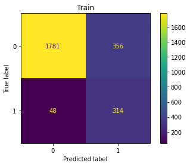


Once again, we are beating our baseline; but there is a good chance that we are overfitting, evinced by the lack of coordination between train and test results.  

## Complex Models
---
In this section, we will explore the results of more complex models, which are generally capable of better predictions but at the cost of higher computational complexity. Note that we did not choose these models for any particular reason; though our motivation for XGBoost comes from its fame within the industry.

### Random Forest

We expect that the random forest will perform well - and probably better than any of our simple models. 


```python
rf_pipe = Pipeline(steps=[('rf', RandomForestClassifier(random_state=42))])

rf_grid = {
    'rf__n_estimators':list(range(10,101,10)),
    'rf__class_weight':[None, 'balanced'],
    'rf__max_depth':list(range(1,11))
}

cv = RepeatedStratifiedKFold(n_splits=5, n_repeats=3, random_state=42)

rf_gs = GridSearchCV(estimator=rf_pipe, 
                     param_grid=rf_grid, 
                     cv=cv,
                     scoring=f4_score)

rf_gs.fit(X_train, np.ravel(y_train))
rf_best = rf_gs.best_estimator_
```


```python
y_train_pred_rf = rf_best.predict(X_train)
y_test_pred_rf = rf_best.predict(X_test)

print('Train')
print(classification_report(y_train, y_train_pred_rf))
print()
print('Test')
print(classification_report(y_test, y_test_pred_rf))

plot_confusion_matrix(rf_best, X_train, y_train);
plt.title('Train');
plot_confusion_matrix(rf_best, X_test, y_test)
plt.title('Test');
```

    Train
                  precision    recall  f1-score   support
    
               0       0.98      0.93      0.95      2137
               1       0.67      0.87      0.76       362
    
        accuracy                           0.92      2499
       macro avg       0.83      0.90      0.86      2499
    weighted avg       0.93      0.92      0.92      2499
    
    
    Test
                  precision    recall  f1-score   support
    
               0       0.96      0.90      0.93       713
               1       0.56      0.79      0.66       121
    
        accuracy                           0.88       834
       macro avg       0.76      0.84      0.79       834
    weighted avg       0.90      0.88      0.89       834
    


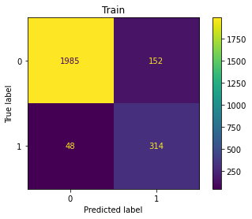


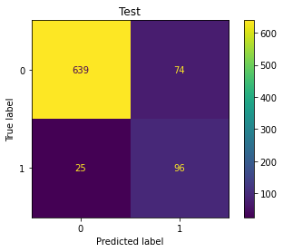


It looks as though our random forest has given us our best results thus far. However, it may be overfitting some, so we need to tweak a few of the parameters to ensure that our model does not overfit to the train data. 

### XGBoost

And finally - the holy grail of machine learning classification models - XGBoost. Because of its track record as being a superstar algorithm amongst classification models, we expect that XGBoost will top all of our models thus far by decent margin. 


```python
from xgboost import XGBClassifier
```


```python
xgb_pipe = Pipeline(steps=[('scaler', StandardScaler()),
                           ('xgb', XGBClassifier())])

xgb_grid = {
    'xgb__learning_rate': [0.1, 0.2],
    'xgb__max_depth': [2, 5],
    'xgb__min_child_weight': [1, 2],
    'xgb__subsample': [0.2, 0.5],
    'xgb__n_estimators': [10, 65, 100],
    'xgb__colsample_bytree':[.2, .5],
    'xgb__scale_pos_weight': [.2, .4]
}

cv = RepeatedStratifiedKFold(n_splits=5, n_repeats=3, random_state=42)

gs_xgb = GridSearchCV(estimator=xgb_pipe, 
                      param_grid=xgb_grid, 
                      scoring=f4_score, 
                      cv=cv, 
                      n_jobs=16)

gs_xgb.fit(X_train, y_train)
xgb_best = gs_xgb.best_estimator_
```


```python
y_train_pred_xgb = gs_xgb.predict(X_train)
y_test_pred_xgb = gs_xgb.predict(X_test)

print('Train')
print(classification_report(y_train, y_train_pred_xgb))
print()
print('Test')
print(classification_report(y_test, y_test_pred_xgb))
plot_confusion_matrix(gs_xgb, X_train, y_train);
plt.title('Train');
plot_confusion_matrix(gs_xgb, X_test, y_test);
plt.title('Test');
```

    Train
                  precision    recall  f1-score   support
    
               0       0.97      1.00      0.99      2137
               1       1.00      0.84      0.91       362
    
        accuracy                           0.98      2499
       macro avg       0.99      0.92      0.95      2499
    weighted avg       0.98      0.98      0.98      2499
    
    
    Test
                  precision    recall  f1-score   support
    
               0       0.94      0.99      0.96       713
               1       0.90      0.60      0.72       121
    
        accuracy                           0.93       834
       macro avg       0.92      0.80      0.84       834
    weighted avg       0.93      0.93      0.93       834
    


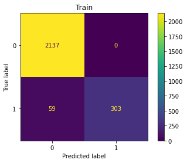


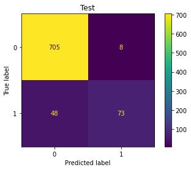


By comparing our evaulation metrics, we know that our model is overfitting. Let's mitigate the issue by tuning some of our hyperparameters!


```python
xgb_best
```


    Pipeline(steps=[('scaler', StandardScaler()),
                    ('xgb',
                     XGBClassifier(base_score=0.5, booster='gbtree',
                                   colsample_bylevel=1, colsample_bynode=1,
                                   colsample_bytree=0.5, gamma=0, gpu_id=-1,
                                   importance_type='gain',
                                   interaction_constraints='', learning_rate=0.2,
                                   max_delta_step=0, max_depth=5,
                                   min_child_weight=1, missing=nan,
                                   monotone_constraints='()', n_estimators=100,
                                   n_jobs=0, num_parallel_tree=1, random_state=0,
                                   reg_alpha=0, reg_lambda=1, scale_pos_weight=0.4,
                                   subsample=0.5, tree_method='exact',
                                   validate_parameters=1, verbosity=None))])


```python
xgb_best = Pipeline(steps=[('scaler', StandardScaler()),
                           ('xgb', XGBClassifier(learning_rate= 0.2,
                                    max_depth= 5,
                                    min_child_weight= 2,
                                    gamma=2.6,
                                    n_estimators= 25,
                                    subsample= 0.7))])

xgb_best.fit(X_train, y_train)
```


    Pipeline(steps=[('scaler', StandardScaler()),
                    ('xgb',
                     XGBClassifier(base_score=0.5, booster='gbtree',
                                   colsample_bylevel=1, colsample_bynode=1,
                                   colsample_bytree=1, gamma=2.6, gpu_id=-1,
                                   importance_type='gain',
                                   interaction_constraints='', learning_rate=0.2,
                                   max_delta_step=0, max_depth=5,
                                   min_child_weight=2, missing=nan,
                                   monotone_constraints='()', n_estimators=25,
                                   n_jobs=0, num_parallel_tree=1, random_state=0,
                                   reg_alpha=0, reg_lambda=1, scale_pos_weight=1,
                                   subsample=0.7, tree_method='exact',
                                   validate_parameters=1, verbosity=None))])


```python
y_train_pred_xgb = xgb_best.predict(X_train)
y_test_pred_xgb = xgb_best.predict(X_test)

print('Train')
print(classification_report(y_train, y_train_pred_xgb))
print()
print('Test')
print(classification_report(y_test, y_test_pred_xgb))
plot_confusion_matrix(gs_xgb, X_train, y_train);
plt.title('Train');
plot_confusion_matrix(gs_xgb, X_test, y_test);
plt.title('Test');
```

    Train
                  precision    recall  f1-score   support
    
               0       0.97      1.00      0.98      2137
               1       0.98      0.83      0.90       362
    
        accuracy                           0.97      2499
       macro avg       0.97      0.92      0.94      2499
    weighted avg       0.97      0.97      0.97      2499
    
    
    Test
                  precision    recall  f1-score   support
    
               0       0.96      0.99      0.97       713
               1       0.91      0.74      0.82       121
    
        accuracy                           0.95       834
       macro avg       0.93      0.87      0.90       834
    weighted avg       0.95      0.95      0.95       834
    


## Evaluation
---

We evaluate our models based on their abilities to maximize the number of identified churning customers while minimizing the misidentified non-churning customers. Again, the F-4 score comes in handy because it enables us to quadruple weight recall as to incentivize our model to treat the identification of churning customers with higher priority than hedging against the misidentification of non-churning customers. This is because mitigating a single unit of churn has a higher return in revenue than does the loss associated with a single unit of non-churn, we estimate in the around the order of 4 times.  

Additional considerations include model complexity/interpretability and predictive time consumption.


```python
model_types = ['LogReg',
               'k-NN',
               'GNB',
               'DT',
               'RF',
               'XGBoost']

best_models = [lr_best,
               knn_best,
               gnb_best,
               dt_best,
               rf_best,
               xgb_best]

y_preds = [y_test_pred_lr,
           y_test_pred_knn,
           y_test_pred_gnb,
           y_test_pred_dt,
           y_test_pred_rf,
           y_test_pred_xgb,]

accuracies = [accuracy_score(y_test, y_pred) for y_pred in y_preds]
precisions = [precision_score(y_test, y_pred) for y_pred in y_preds]
recalls = [recall_score(y_test, y_pred) for y_pred in y_preds]
f4s = [5*p*r/(p + 4*r) for p,r in zip(precisions, recalls)]
```


```python
fig, ax = plt.subplots(nrows=2, ncols=2, figsize=(12,12))

ax[0,0].bar(model_types, accuracies);
ax[0,0].set_title('Accuracy');

ax[0,1].bar(model_types, precisions);
ax[0,1].set_title('Precision');

ax[1,0].bar(model_types, recalls);
ax[1,0].set_title('Recall');

ax[1,1].bar(model_types, f4s);
ax[1,1].set_title('F4');

fig.text(0.5, 0.04, 'Models', ha='center', fontsize=14);
fig.text(0.04, 0.5, 'Scores', va='center', rotation='vertical', fontsize=14);
plt.show()
```


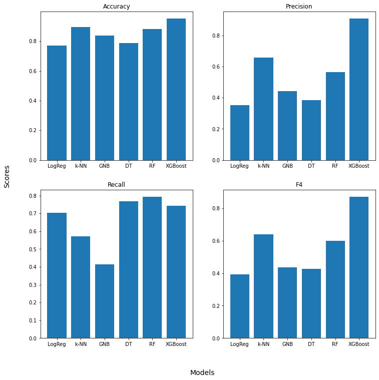


Based soley on our metrics, we would expect that XGBoost would do the best job in the field. However, Random Forest and kNN also perform well. We eliminate kNN because of its lack of interpretability. Between Random Forest and XGB, the better model would be decided based on retnetion campaign metrics - so we cannot say for certain which would be better for SyriaTel until be know more about their client base. Either will perform to an extent to give SyriaTel an edge over its competition, and will lead to an increase in revenue overall for SyriaTel. 

## Conclusion
---

There were several ends that we did not investigate. For example, we did not explore several combinations of our variables per model, and we did rule out some possibilities early on as a result of what one might term pragmatism that could have yielded some signficant result. We classify our approach as that which is most likely to yield the best results given time constraints. We also did have several cases of potential overfitting that we may not have addressed sufficiently. With this given, we believe that we have perfomed as exhaustive a search as we could have.

That said, we believe that our final model will be able to boost overall revenues for SyriaTel by a company-changing amount. With our model, the future is brighter than it looked yesterday. 

## Future Research
---

We absolutely must pursue several leads in order to fuel optimal model development:

<ul>
    <li><b>Find more robust churn predictors</b>, such as dropped calls per customer or internet download speed per region. If we know why people are churning, we can do a better job addressing churn.</li>
    <li><b>Analyze promotional success</b>, we need to know the types and the success rates of various promotionals so that we can better calibrate our model for overall revenues.</li>
    <li><b>Market research</b>, we need to know why customers are churning and which companies they're going to after they churn. That way, we know where we can improve.</li>
    <li><b>Customer survey</b>, we need to know on a case-to-case level how customers are using our service. That way, we know what to offer each customer in the case that they show warning signs of churn.</li>
</ul>
   
Overall, there is still much work to be done. We look forward to working with SyriaTel through these challenges in order to maximize overall revenue. 
